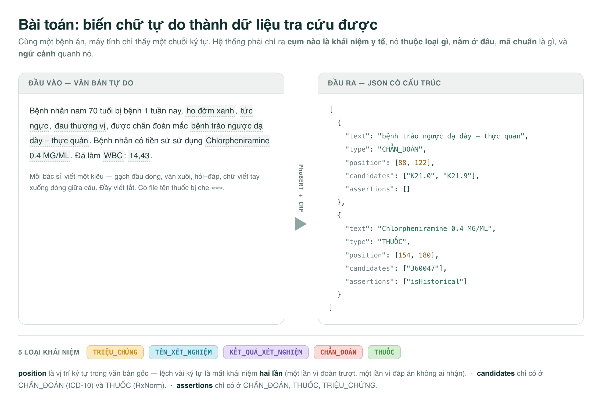
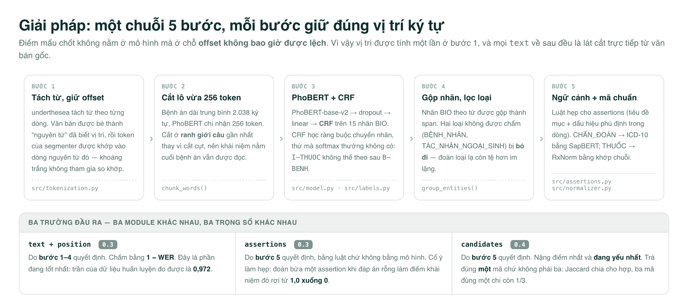
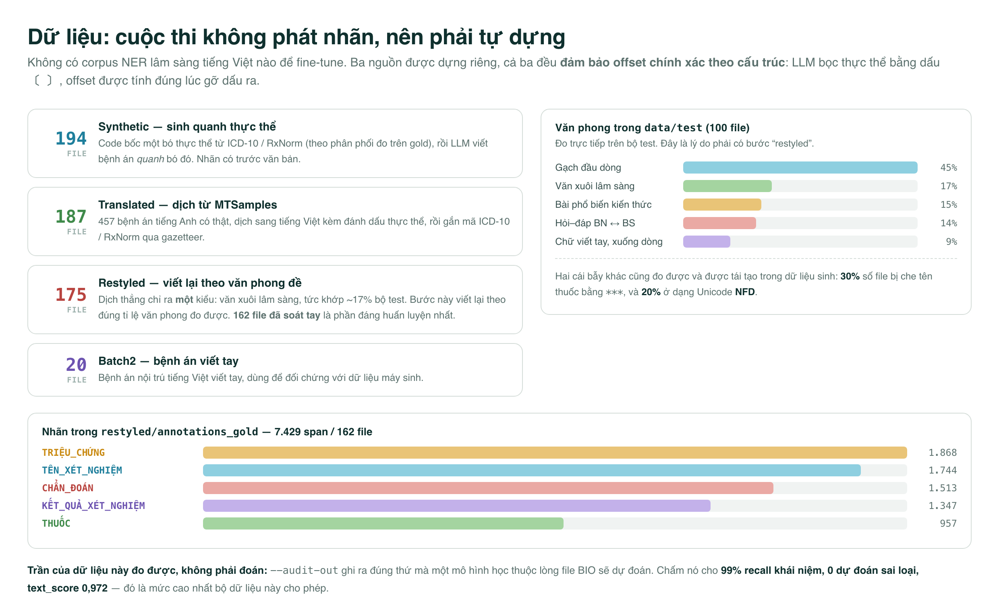
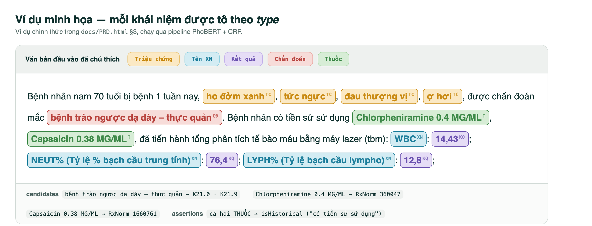

<h1 align="center">Smart Medic</h1>

<p align="center">
  <b>Đọc bệnh án tiếng Việt viết tự do → trả về khái niệm y tế có mã chuẩn và ngữ cảnh.</b><br>
  <sub>Viettel AI Race 2026 — Vòng 1 · PhoBERT-base-v2 + CRF</sub>
</p>

---

## 1. Bài toán

Bệnh án ở Việt Nam gần như toàn bộ là **chữ viết tự do**. Máy tính không thống kê, không
tra cứu bảo hiểm, không nghiên cứu dịch tễ được trên mớ chữ đó. Việc của hệ thống này là
biến nó thành dữ liệu có cấu trúc.



Với mỗi đoạn văn bản, cần trả về danh sách khái niệm, mỗi khái niệm gồm 5 trường:

| Trường | Ý nghĩa | Áp dụng cho |
|---|---|---|
| `text` | đúng cụm từ trong văn bản | tất cả |
| `position` | `[start, end]` — vị trí ký tự trong văn bản gốc | tất cả |
| `type` | 1 trong 5 loại khái niệm | tất cả |
| `assertions` | `isNegated` · `isFamily` · `isHistorical` | `CHẨN_ĐOÁN`, `THUỐC`, `TRIỆU_CHỨNG` |
| `candidates` | mã chuẩn — ICD-10 / RxNorm | `CHẨN_ĐOÁN`, `THUỐC` |

**5 loại khái niệm:** `TRIỆU_CHỨNG` · `TÊN_XÉT_NGHIỆM` · `KẾT_QUẢ_XÉT_NGHIỆM` · `CHẨN_ĐOÁN` · `THUỐC`

Đề bài đầy đủ: [`docs/PRD.html`](docs/PRD.html).

---

## 2. Giải pháp



Phần khó nhất **không phải mô hình** mà là `src/tokenization.py`. underthesea không giữ
khoảng trắng và không trả vị trí — nó trả `["đau nhức"]` cho đoạn văn bản có thể vốn là
`"đau\nnhức"`. Đi tìm chuỗi token trong văn bản gốc thì gặp từ lặp lại là khớp nhầm chỗ.

Cách làm ở đây: bẻ văn bản thành **“nguyên tử”** (cụm chữ/số liền nhau, hoặc một dấu đơn)
đã biết sẵn vị trí, rồi khớp token của segmenter vào dòng nguyên tử đó. Khoảng trắng không
tham gia so khớp, và một token bị segmenter sửa chỉ làm lệch **một từ** thay vì kéo lệch
toàn bộ phần còn lại. Nhờ vậy `text == raw[start:end]` đúng **theo cấu trúc, không nhờ may mắn**.

Tự kiểm tra được, không cần torch hay underthesea:

```bash
python src/tokenization.py
```

---

## 3. Dữ liệu



---

## 4. Demo

Ví dụ chính thức của đề (`docs/PRD.html` §3), chạy qua pipeline. Cả 5 loại xuất hiện trong
một bệnh án, và hai thuốc nằm sau cụm *“có tiền sử sử dụng”* — đó là lý do chúng mang
`isHistorical`:



Để ý phần xét nghiệm: `WBC` / `14,43`, `NEUT% (…)` / `76,4` — **tên xét nghiệm và kết quả
nằm sát nhau nhưng là hai loại khác nhau**. Đây đúng là ca làm khó bộ dựng BIO nhất, vì
segmenter hay dính tên xét nghiệm liền với kết quả thành một từ, mà BIO chỉ cho mỗi từ một
nhãn. Trên gold restyled, chuyện này làm mất **76 / 7.435** khái niệm và nới rộng thêm 217 cái.

Đầu ra thật của `src/test.py`:

```json
[
  {
    "text": "đau khớp gối phải",
    "type": "TRIỆU_CHỨNG",
    "candidates": [],
    "assertions": [],
    "position": [26, 43]
  }
]
```

---

## 5. Cài đặt

Cần **Python 3.8+**.

```bash
python -m venv .venv
source .venv/bin/activate          # Windows: .\.venv\Scripts\Activate.ps1
python -m pip install --upgrade pip
python -m pip install -r requirements.txt
```

<details>
<summary><b>Lưu ý theo từng môi trường (GPU, và một cái bẫy tên package)</b></summary>

<br>

- **`pytorch-crf`** — cài bằng `pip install pytorch-crf` nhưng **import là `torchcrf`**.
  Đừng cài gói tên na ná là `TorchCRF`; nó có API khác (thiếu `batch_first`) và đụng nhau
  trên hệ thống file không phân biệt hoa thường như Windows.
- **macOS** — bản `pip install torch` mặc định là đúng. Trên Apple Silicon script tự dùng
  GPU qua **MPS** (thứ tự ưu tiên: CUDA → MPS → CPU), không cần cấu hình gì.
- **Linux / Windows có GPU NVIDIA** — cài bản CUDA trước, rồi mới cài phần còn lại:

  ```bash
  python -m pip install torch torchvision torchaudio --index-url https://download.pytorch.org/whl/cu124
  python -m pip install -r requirements.txt
  ```

  Kiểm tra: `python -c "import torch; print(torch.cuda.is_available())"`

</details>

### Từ điển chuẩn hoá phải tự đặt vào

Các bảng từ vựng **không được theo dõi trong git** (dung lượng lớn, ràng buộc bản quyền) —
`/data/knowledge_base` nằm trong `.gitignore`. Muốn chạy được phần gắn mã, phải tự đặt vào:

```
data/knowledge_base/
├── ICD10_VN.csv     # ICD-10 Bộ Y tế 2020 — 12.218 mã lá ở cột MÃ BỆNH, tên Việt ở TÊN BỆNH
└── RXNORM.csv       # RXNCONSO (chỉ tên thuốc)
```

Thiếu `ICD10_VN.csv` thì **`src/inference.py` chết ngay lúc khởi tạo** (nó đọc file này
không có rào). Thiếu `RXNORM.csv` thì `normalizer.py` chỉ cảnh báo rồi trả về không mã nào
— tức mất trắng 0,4 điểm. Xem [mục 8](#8-trạng-thái--việc-cần-làm).

---

## 6. Chạy thử

```bash
# Một câu, in JSON ra màn hình
python src/test.py -t "Bệnh nhân nam 55 tuổi, bị đau khớp gối phải" \
                   --model models/pho_bert_crf_medical.pth

# Một file
python src/test.py -f data/test/7.txt --model models/pho_bert_crf_medical.pth

# Cả thư mục: data/test/7.txt → data/output/7.json
python src/test.py -d data/test -o data/output --model models/pho_bert_crf_medical.pth
```

| Tham số | Ý nghĩa |
|---|---|
| `-t` | văn bản truyền thẳng |
| `-f` | đọc từ một file |
| `-d` | dự đoán mọi `.txt` trong thư mục, ghi `<tên>.json` |
| `-o` | nơi `-d` ghi ra (mặc định `data/output`, đúng bố cục `output.zip` cần) |
| `--model` | đường dẫn trọng số đã huấn luyện |
| `--linker` | `sapbert` (mặc định) hoặc `rapidfuzz` cho khâu gắn mã ICD |

Chế độ thư mục nạp mô hình một lần, một file lỗi không làm hỏng 99 file còn lại, và cảnh
báo hai thứ âm thầm phá bài nộp: khái niệm có `text` **không khớp** lát cắt tại `position`
của chính nó, và file `.json` cũ còn sót trong thư mục output.

Văn bản dài hơn 256 token của PhoBERT được **chia lô ở ranh giới câu** chứ không cắt cụt,
nên khái niệm nằm cuối bệnh án vẫn được tìm thấy.

---

## 7. Huấn luyện lại từ đầu

Bốn lệnh, có chừa sẵn phần để đo:

```bash
# 1. nhãn JSON → file BIO, chừa 24 file để đo (chia theo văn phong, không bốc đều)
python scripts/prepare_training_data.py --holdout 24

# 2. huấn luyện
python src/train.py --data data/train_generated.txt --from-scratch -e 6

# 3. dự đoán phần đã chừa
python src/test.py -d data/holdout/text -o data/holdout/pred \
                   --model models/pho_bert_crf_medical.pth

# 4. chấm
python scripts/evaluate.py --pred data/holdout/pred --gold data/holdout/gold \
                           --text-dir data/holdout/text
```

> `evaluate.py` phải tự giả định cách ghép pred ↔ đáp án vì đề không nói rõ (xem docstring
> của script). Hãy đọc điểm ở đây như **chỉ báo tương đối** để so hai phiên bản model với
> nhau, không phải điểm của BTC.

Vì sao chia theo văn phong chứ không bốc ngẫu nhiên đều: tỉ lệ văn phong trong bộ sinh không
giống bộ test — có kiểu chỉ vài file trong bộ sinh nhưng lại thường gặp trong bộ test. Bốc đều
24 file thì kiểu hiếm gần như chắc chắn vắng mặt, mà điểm trung bình vẫn đẹp đẽ — chỗ yếu nằm
ngoài tầm nhìn.

**Đo trần của dữ liệu trước khi trách mô hình.** `--audit-out` ghi ra đúng thứ mà một mô
hình học thuộc lòng file BIO sẽ dự đoán. Khoảng cách giữa trần đó và điểm thật cho biết nên
sửa mô hình hay sửa dữ liệu:

```bash
python scripts/prepare_training_data.py --audit-out data/audit_ceiling
python scripts/evaluate.py --pred data/audit_ceiling \
    --gold data/generated_medical_records/restyled/annotations_gold \
    --text-dir data/generated_medical_records/restyled/text
```

<details>
<summary><b>Định dạng file BIO, và các tham số huấn luyện</b></summary>

<br>

Kiểu CoNLL — mỗi dòng một từ kèm nhãn, khối cách nhau bằng dòng trống. Nhãn lấy từ **cuối
dòng**, nên bản thân từ được phép chứa khoảng trắng — đó chính là thứ tách từ tiếng Việt sinh ra:

```text
đau B-TRIEU_CHUNG
khớp I-TRIEU_CHUNG
gối I-TRIEU_CHUNG
. O
Celecoxib B-THUOC
400mg I-THUOC
```

`scripts/prepare_training_data.py` gọi **đúng hàm `segment_document()` mà `src/inference.py`
gọi**. Đây không phải chi tiết vụn: tách từ hai đường khác nhau là dạy một thứ rồi hỏi một thứ khác.

Tham số chính nằm ở đầu `src/train.py`: `MODEL_NAME`, `MAX_LEN`, `BATCH_SIZE`, `EPOCHS`, `LR`.
Lần chạy đầu tải trọng số PhoBERT từ Hugging Face Hub (cần mạng).

</details>

---

## 8. Trạng thái & việc cần làm

> **Chưa có điểm nào được đo và ghi lại.** Toàn bộ bộ khung holdout + trần dữ liệu ở mục 7
> đã dựng xong nhưng chưa chạy và chưa lưu kết quả, nên hiện chưa có bằng chứng so sánh với
> nhánh giải pháp bằng luật (`feature/solution_v7.2`). Đây là việc đáng làm trước tiên.

| # | Vấn đề | Ảnh hưởng |
|---|---|---|
| 1 | **PhoBERT không hề nhìn thấy kết quả tách từ.** PhoBERT-v2 được pretrain trên văn bản đã tách từ, nối bằng `_` — `'bệnh_nhân'` là **một** token trong từ điển, `'bệnh nhân'` là hai. Cả `dataset.py:46` và `inference.py:76` đang mã hoá với dấu cách nguyên vẹn. | Không sai (train và inference nhất quán), nhưng vứt đi tín hiệu từ ghép mà `tokenization.py` vất vả tính ra. **Sửa một dòng ở mỗi file**, và làm hỏng checkpoint cũ. Đây là đòn bẩy lớn nhất. |
| 2 | **Loss của CRF đang cộng dồn, không lấy trung bình.** `torchcrf` mặc định `reduction='sum'`. | Learning rate thực tế gấp ~16 lần con số `2e-5` ghi trong file; loss in ra không so sánh được giữa các batch size. Nên đổi sang `reduction='token_mean'`. Chưa có gradient clipping, chưa cố định seed. |
| 3 | **Không còn từ điển nào trong repo.** Xem ⚠️ [mục 5](#từ-điển-chuẩn-hoá-phải-tự-đặt-vào). | `inference.py` chết ngay khi khởi tạo trên bản clone sạch. |
| 4 | **Gọi RxNav qua mạng lúc suy luận.** `normalizer.to_ingredient()` gọi mạng cho mỗi mã biệt dược chưa gặp, timeout 5 giây, mà cache `rxnorm_to_in.json` lại nằm trong thư mục bị gitignore. | Chấm offline sẽ âm thầm để nguyên mã biệt dược, mà đáp án là mã hoạt chất → 0 điểm. Nên tính sẵn cache rồi commit vào. |
| 5 | Độ dài ngữ cảnh lúc train ≠ lúc chạy — khối huấn luyện chặn ở 80 từ, còn inference cắt lô ở 254 subword. | |
| 6 | `train.py` luôn lưu vào `MODEL_PATH` cứng bất kể `--checkpoint`; không có vòng validation, không chấm theo epoch, không chọn checkpoint tốt nhất. | |
| 7 | `requirements.txt` ghi “versions verified working” nhưng các pin (torch 2.13, transformers 5.14, pandas 3.0) đều là bản mới nhất và **không khớp** môi trường đang chạy được (torch 2.9.1, transformers 4.57.1, pandas 2.3.3). | transformers 4→5 và pandas 2→3 đều là major. |

<details>
<summary><b>Khâu gắn mã (<code>candidates</code>) — đã đo được gì</b></summary>

<br>

`candidates` chiếm 0,4 điểm và đang là phần yếu nhất, nên có công cụ chẩn đoán riêng:

```bash
python scripts/measure_normalizer.py
```

Đo trên 1.456 mã chẩn đoán + 980 mã thuốc của gold sinh ra — đây là nguồn gốc các hằng số
ở đầu `src/normalizer.py`:

- **Một mã thắng ba mã.** Đáp án chỉ có đúng một mã ở 1.456/1.536 chẩn đoán và 814/952
  thuốc; Jaccard chia cho hợp, nên ba mã mà đúng một vẫn chỉ được 1/3. → `DEFAULT_TOP_K = 1`.
- **Ngưỡng cũ vứt nhầm đáp án đúng.** Ngưỡng `> 65` / `> 70` loại mất 41,6% mã ICD đúng và
  23,2% mã RxNorm đúng mà tra cứu đã tìm ra. Hạ xuống 60 và 55 đưa chẩn đoán 0,146 → 0,196
  và thuốc 0,287 → 0,312.
- **Thuốc hỏng ở tầng phân cấp, không phải ở chữ.** Điểm khớp tên của một mã thuốc đúng
  thường là 100 — khớp chính xác. Đáp án dùng mã **hoạt chất** (Lasix → `4603` furosemide)
  còn tra cứu trả về mã **biệt dược** (`202991`). Đây là đòn bẩy lớn nhất còn lại.
- **Chẩn đoán hỏng ở khâu truy hồi.** `token_sort_ratio` so cả chuỗi, nên một cụm ngắn nằm
  lọt trong tên chính thức dài sẽ thua chỉ vì độ dài: “Rung nhĩ” đấu với `I48` “Rung nhĩ và
  cuồng nhĩ” lại thua `K03.1` “Mòn răng”. Mã đúng chỉ lọt top-10 ở 30,1% số span.

</details>

---

## 9. Cấu trúc thư mục

```
smart-medic/
├── src/
│   ├── model.py            # PhoBERT + CRF
│   ├── dataset.py          # đọc file BIO, gióng nhãn theo subword
│   ├── train.py            # huấn luyện → models/pho_bert_crf_medical.pth
│   ├── inference.py        # MedicalExtractor: trích xuất + chuẩn hoá
│   ├── test.py             # CLI chạy thử (-t / -f / -d)
│   ├── tokenization.py     # tách từ giữ offset (tự test được)
│   ├── labels.py           # nhãn BIO ↔ 5 loại được chấm
│   ├── assertions.py       # isNegated / isFamily / isHistorical
│   ├── normalizer.py       # gắn mã RxNorm / ICD-10
│   └── web/                # UI soát nhãn (python src/web/app.py → :8765)
├── scripts/
│   ├── gen_sample_data.py        # sinh dữ liệu huấn luyện
│   ├── prepare_training_data.py  # nhãn JSON → file BIO
│   ├── annotate.py               # gán nhãn tay bằng dấu 〔 〕
│   ├── evaluate.py               # chấm điểm nội bộ theo metric BTC
│   └── measure_normalizer.py     # chẩn đoán khâu gắn mã
├── data/
│   ├── knowledge_base/     # ICD-10 / RxNorm — TỰ ĐẶT VÀO, không có trong git
│   ├── test/               # 100 bệnh án của đề
│   ├── output/             # dự đoán, mỗi file một bệnh án
│   └── generated_medical_records/   # corpus tự sinh (synthetic / translated / restyled)
├── docs/
│   ├── PRD.html            # đề bài đầy đủ
│   └── images/             # ảnh minh hoạ cho README (kèm .html sinh ra chúng)
└── models/                 # trọng số đã huấn luyện
```

<details>
<summary><b>Sinh thêm dữ liệu huấn luyện</b></summary>

<br>

```bash
# A. Synthetic — code bốc thực thể, LLM viết bệnh án quanh nó
python scripts/gen_sample_data.py compose --n 200 --use-api
python scripts/gen_sample_data.py emit

# B. Translated — dịch bệnh án tiếng Anh có thật
python scripts/gen_sample_data.py translate --n 100 --use-api --model gpt-4o

# C. Restyled — viết lại theo đúng tỉ lệ văn phong của bộ test
python scripts/gen_sample_data.py restyle --use-api --model gpt-4o

# Kiểm tra: lỗi offset, độ phủ mã, so với bộ test
python scripts/gen_sample_data.py verify
```

`compose` và `translate` cần `OPENAI_API_KEY` khi chạy với `--use-api`. Không có key thì
chúng ghi prompt ra `intermediate/` để bạn tự gọi model nào cũng được, rồi nạp lại bằng
`--composed FILE` / `--translated FILE`. Đặt `OPENAI_BASE_URL` nếu dùng endpoint tương thích
OpenAI (Azure, vLLM, OpenRouter).

Dịch 100 bệnh án tốn khoảng 5–10 USD với gpt-4o. Chạy `--n 5` trước để xem chất lượng dịch
đã ổn chưa.

</details>

<details>
<summary><b>Tự gán nhãn một bộ dev</b></summary>

<br>

```bash
python scripts/annotate.py skeleton --n 15   # chép 15 file test vào data/dev/marked/
python scripts/annotate.py status            # xem đã gán tới đâu
python scripts/annotate.py compile           # dấu 〔 〕 → data/dev/gold/*.json
```

Gán nhãn bằng cách bọc từng khái niệm, giữ nguyên phần chữ xung quanh:

```text
〔LOẠI|text〕                        span không mã, không assertion
〔LOẠI|text|code〕                   kèm mã chuẩn (chỉ CHẨN_ĐOÁN và THUỐC)
〔LOẠI|text|code1,code2|isNegated〕  nhiều mã, kèm assertion
```

`compile` chỉ ghi file gold khi văn bản đã gỡ dấu **giống hệt từng ký tự** với bản gốc, nên
một lần lỡ tay sửa chữ không bao giờ âm thầm làm lệch offset.

</details>

---

## 10. Yêu cầu nộp bài (Vòng 1)

- Nộp `output.zip` chứa `output/1.json … output/100.json`.
- Khoảng 15 đội đứng đầu phải nộp **toàn bộ mã nguồn** (xử lý dữ liệu, huấn luyện, suy luận),
  **dữ liệu đã dùng**, **trọng số mô hình** và README hướng dẫn cài đặt — không tái lập được
  thì bị loại.

## 11. Giấy phép

Mã nguồn trong repo theo [giấy phép MIT](LICENSE). Dữ liệu tham chiếu của bên thứ ba
(ICD-10, RxNorm…) giữ nguyên điều khoản gốc, đưa vào đây chỉ để nghiên cứu và dự thi.
