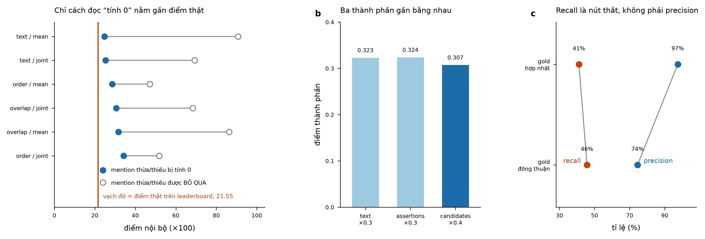

# Bước 2 — gold dev hai model + đọc metric (2026-07-27)

Chạy 20 file dev qua `claude-opus-5` và `claude-sonnet-5` độc lập, ingest bằng
`scripts/preannotate_dev.py --ingest`, rồi diff. LLM gọi từ ngoài repo — không thêm
dependency nào, NFR1 nguyên vẹn.

## 1. Fan-out

| | opus-5 | sonnet-5 |
|---|---|---|
| file | 20/20 | 20/20 |
| mention ingest | 978 | 932 |
| drop (không định vị được) | 0 | 0 |
| lỗi schema | 0 | 0 |

`max_tokens=16000` **không đủ**: thinking chiếm 71% (opus) và 87% (sonnet) output.
12/20 file sonnet trả rỗng vì tiêu hết ngân sách vào thinking. Chạy lại ở 32768 thì sạch.
→ **Cho silver: đặt `max_tokens=32768` ngay từ đầu.**

## 2. Đồng thuận

Ghép span theo position chính xác, phần còn lại ghép tham lam theo IoU (nếu không,
`xét nghiệm thiếu men G6PD` vs `thiếu men G6PD` bị đếm thành hai "chỉ một model có").

| loại | số | % |
|---|---|---|
| đồng thuận hoàn toàn | 689 | 68.7% |
| lệch mã (candidates) | 84 | 8.4% |
| lệch ranh giới span | 92 | 9.2% |
| chỉ opus bắt được | 71 | 7.1% |
| chỉ sonnet bắt được | 25 | 2.5% |
| lệch assertion | 22 | 2.2% |
| lệch nhãn (type) | 20 | 2.0% |
| **union** | **1003** | cần đọc tay **314 (31.3%)** |

## 3. Chuẩn hoá mã trước khi giao người đọc

Đối chiếu mọi mã với `data/kb/`: 8/136 ICD và 1/21 RxCUI không có trong KB.

- 8 mã ICD đều là **ICD-10-CM (Mỹ)** trong khi KB dùng **ICD-10 WHO**. Xác minh qua
  `clinicaltables.nlm.nih.gov`, cắt về mã WHO thì cả 8 đều có trong KB:
  `G47.33→G47.3`, `I25.10→I25.1`, `I25.41→I25.4`, `I48.91→I48.9`,
  `K05.9→K05`, `K20.9→K20`, `L03.90→L03.9`, `R56.9→R56`.
- `RXCUI 727` (nhôm hydroxid): RxNav trả `NotCurrent`, nguồn SNOMEDCT, hết hạn 04/2005.
  Mã đúng là **612** (`aluminium hydroxide`, có trong KB).

Tự giải quyết 9 bất đồng, không cần người đọc. **Đây là lớp lọc nên đưa vào pipeline** —
`_clean_candidates()` hiện chỉ ép kiểu string, không kiểm mã tồn tại, mà candidates
chiếm trọng số 0.4.

## 4. Chính sách trùng lặp — GIẢ THUYẾT BỊ BÁC BỎ

TODO đặt câu hỏi: 30.4% mention là `(text,type)` lặp trong cùng file; nếu gold chỉ gán
một lần mỗi document thì đó là ~482 false positive.

| | tổng mention | lặp | % |
|---|---|---|---|
| gold hợp nhất (20 file) | 1003 | 332 | **33.1%** |
| gold đồng thuận (20 file) | 689 | 223 | 32.4% |
| pred `data/output` (20 file dev) | 423 | 199 | 47.0% |
| pred `data/output` (100 file) | 1585 | 542 | 34.2% |

Gold lặp 33.1% — **cao hơn** pred trên toàn bộ 100 file. Gold KHÔNG gán một lần mỗi
document. **Đừng khử trùng lặp.** Câu hỏi này đã trả lời xong, không tốn lượt nộp nào.

## 5. Đọc metric — `unmatched zero`

| pred vs | text | assertions | candidates | FINAL |
|---|---|---|---|---|
| gold đồng thuận | 0.3229 | 0.3238 | 0.3072 | **0.3169** |
| gold hợp nhất | 0.3670 | 0.3591 | 0.2972 | 0.3367 |

Sweep 12 cách đọc, đối chiếu leaderboard thật 21.5450:

- `--unmatched zero` (phạt) → 31.69 · lệch **10.14**
- `--unmatched skip` (bỏ qua) → 86.31 · lệch 64.77

Mọi cách đọc `skip` đều cho 47–91 điểm, cách xa 21.55. **Kết luận: mention thừa/thiếu
BỊ PHẠT.** Kế hoạch v4 recall-first trong TODO đứng vững, không cần đảo ngược.

## 6. Recall là nút thắt

| gold | recall | precision |
|---|---|---|
| đồng thuận (689) | 45.7% | 74.5% |
| hợp nhất (1003) | 41.1% | 97.4% |

Pipeline hiện tại bắt 423 mention ở nơi hai LLM đồng thuận 689. Precision 74–97% đã tốt;
recall 41–46% là chỗ mất điểm. Ba thành phần điểm gần bằng nhau (0.307–0.324) nên không
có thành phần nào là điểm yếu riêng — tất cả cùng bị recall kéo xuống.

## Việc tiếp theo

1. Đọc `docs/reports/2026-07-27-dev-gold-adjudication.md` — 314 mục, ưu tiên nhóm
   "lệch mã" (84 mục, trọng số 0.4) rồi "lệch nhãn" (20 mục).
2. Chốt `data/dev_gold/`, chấm lại.
3. Thêm lớp validate mã (KB + RxNav) vào `_clean_candidates()`.
4. Silver 100 file ở `max_tokens=32768`.

## File sinh ra

- `data/dev_gold_opus5/`, `data/dev_gold_sonnet5/` — hai lượt riêng
- `data/dev_gold_consensus/` — 689 mention hai model đồng thuận (đã validate schema)
- `data/dev_gold_prefill/` — cả 1003 mention, để adjudicate rồi cắt xuống
- `data/dev_adjudication.json` — 314 mục kèm ngữ cảnh, dạng máy đọc
- `docs/reports/2026-07-27-dev-gold-adjudication.md` — worksheet cho người
- `docs/reports/2026-07-27-metric-sweep.png`

